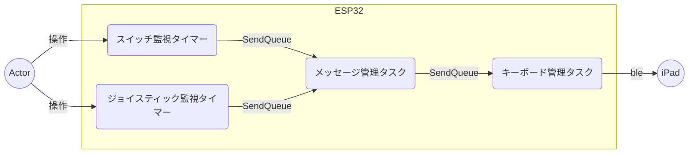

# esp32_mouse

## 動作

| デバイス | 動作 | iPad側への送信 |
| ---------- | ---- | ---- |
| 🕹X軸 | ←操作 | キーボード Arrow Left |
| 🕹X軸 | →操作 | キーボード Arrow Right |
| 🕹Y軸 | ↑操作 | キーボード Arrow Up |
| 🕹Y軸 | ↓操作 | キーボード Arrow Down |
| 🕹スイッチ1 | 押下 | Kindleアプリの起動 |
| スイッチ2 | 押下 | ホーム画面 |
| スイッチ3 | 押下 | キーボード Arrow Left |
| スイッチ4 | 押下 | キーボード Arrow Right |

## タスク構成

|           タスク名           |                            役割                            |
| ---------------------------- | ---------------------------------------------------------- |
| スイッチ監視タイマー         | スイッチのDOWN/UPの変化を監視する                          |
| ジョイスティック監視タイマー | ジョイスティックの変化を監視する                           |
| メッセージ管理タスク         | スイッチ／ジョイスティックのイベントをキーボード管理に通知 |
| キーボード管理タスク         | メッセージ管理から受けたイベントをBleキーボード制御を送信  |

# 参考

詳細は下記に記載してあります。

https://zenn.dev/kotaproj/articles/esp32_blemouse