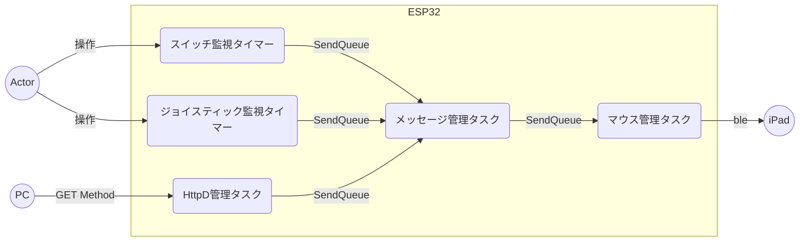

# esp32_mouse

## 関連記事

https://zenn.dev/kotaproj/articles/esp32_blemouse

https://zenn.dev/kotaproj/articles/esp32_mouse_httpd

## 接続図


## 動作

### ジョイスティック／スイッチ


|  デバイス   |        動作        |    iPad側への送信    |
| ----------- | ------------------ | -------------------- |
| 🕹スティック | ←/→/↑/↓操作        | マウスカーソルの移動 |
| 🕹スイッチ1  | プッシュ／リリース | マウス-左ボタン      |
| スイッチ2   | プッシュ／リリース | マウス-右ボタン      |
| スイッチ3   | 押下               | スクロール UP        |
| スイッチ4   | 押下               | スクロール DOWN      |


### HTTPリクエスト

PCからのインターフェイスとなります。
ESP32自体は、プアな環境のため、HTTPのGETメソッドのみで実装としました。

| query  |   value    |             説明             |
| ------ | ---------- | ---------------------------- |
| code   | click      | クリック動作                 |
| -      | move       | カーソル移動 or ホイール動作 |
| -      | press      | マウスボタンダウン動作       |
| -      | release    | マウスボタンアップ動作       |
| type   | left       | 左クリック                   |
| -      | right      | 右クリック                   |
| -      | middle     | 第3ボタンクリック            |
| -      | back       | 戻る                         |
| -      | forward    | 進む                         |
| linear | 0          | カーソル移動 - 離散動作      |
| -      | 1          | カーソル移動 - 連続動作      |
| x      | 整数       | 水平方向の移動量             |
| y      | 整数       | 垂直方向の移動量             |
| wheel  | -128 - 127 | ホイール移動量               |
| step   | 整数(>0)   | 連続動作時の移動量           |
| delay  | 整数(>0)   | 連続動作時の遅延量(msec)     |

- 例:シングルタップを実施
```
GET http://{IP Address}/mouse?code=click&type=left
```
- 例:水平方向-100, 垂直方向+100移動
```
http://{IP Address}/mouse?code=move&x=-100&y=100
```


## タスク構成

|           タスク名           |                            役割                            |
| ---------------------------- | ---------------------------------------------------------- |
| スイッチ監視タイマー         | スイッチのDOWN/UPの変化を監視する                          |
| ジョイスティック監視タイマー | ジョイスティックの変化を監視する                           |
| HTTPd管理タスク              | Webサーバの起動及びクエリーを処理する(ここが追加)                      |
| メッセージ管理タスク         | スイッチ／ジョイスティックのイベントをキーボード管理に通知 |
| マウス管理タスク             | メッセージ管理から受けたイベントをBleマウス制御を送信      |




# 参考

詳細は下記に記載してあります。

https://zenn.dev/kotaproj/articles/esp32_blemouse